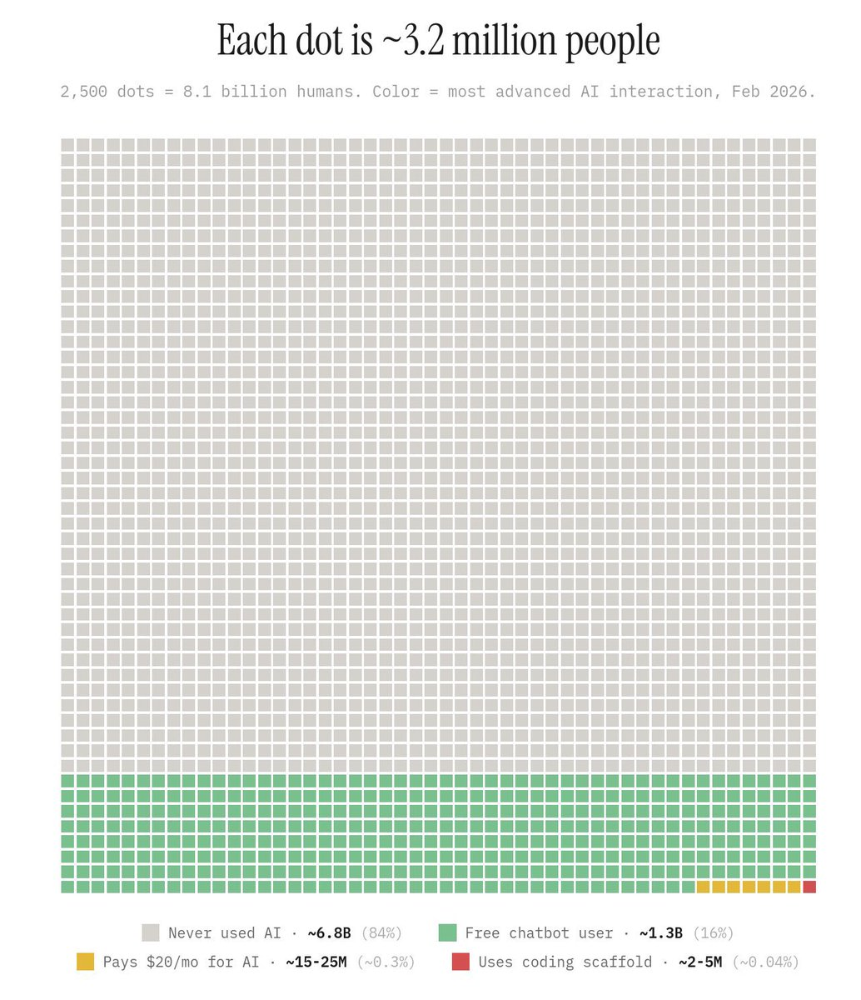
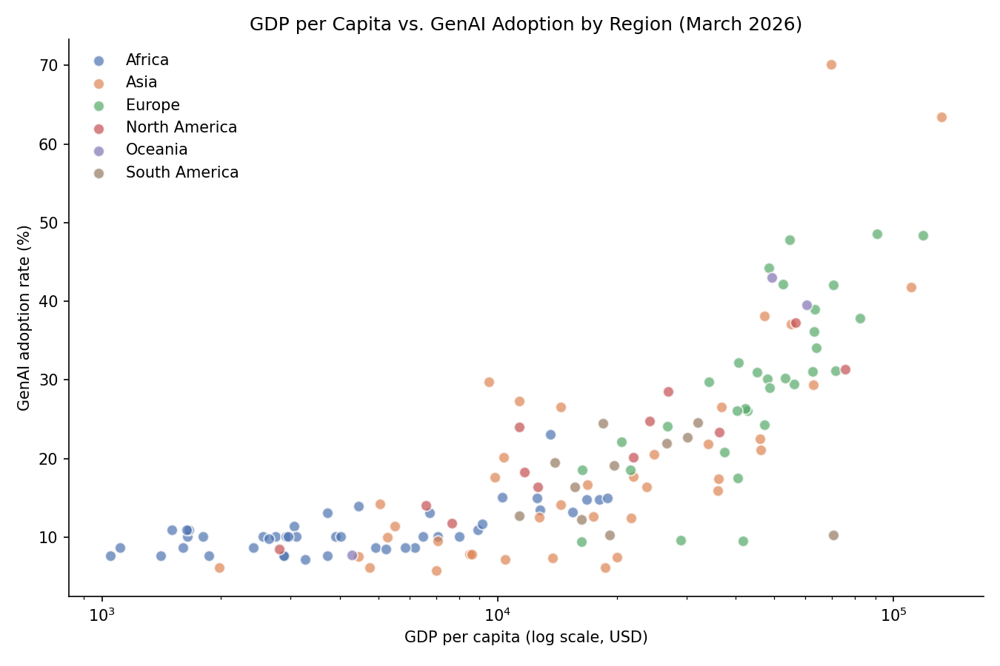
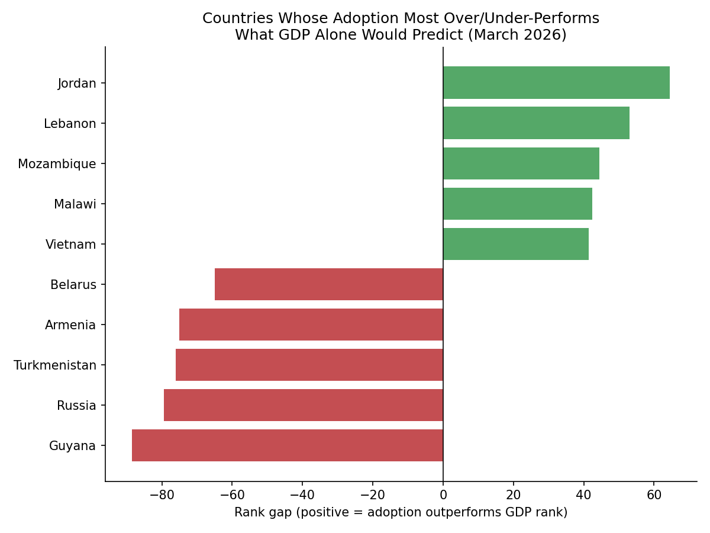
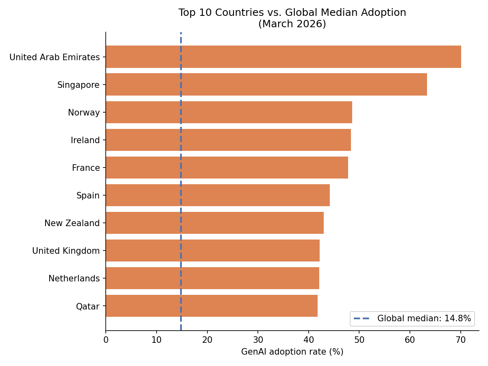
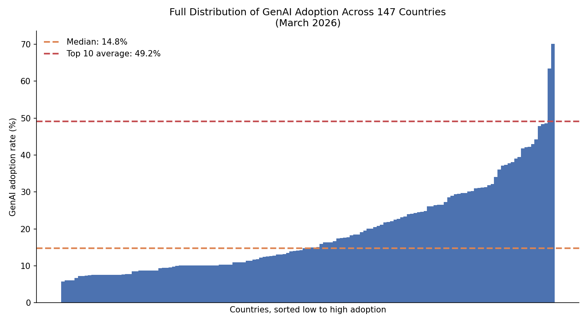
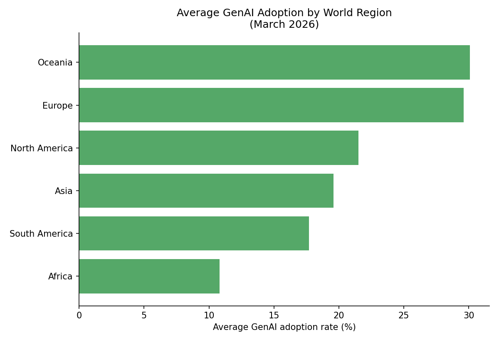

# GenAI Adoption vs. GDP: Is the Hype Real?



**Source:** [LinkedIn Post](https://www.linkedin.com/posts/abhatnagar19_ai-ai-ai-share-7431528567412449280-QaS7/)

I see this infographic floating around on the internet a lot, so I don't know where the original is from. The LinkedIn post I've linked above isn't the first post I've seen it on, but that's what made me interested in this analysis.

## Why I built this

I got interested in this topic after coming across a LinkedIn post citing a GenAI adoption statistic. It was intriguing, since I'd assumed AI usage was a truly global phenomenon, but it made me wonder whether adoption was actually concentrated in certain countries. The infographic in that post didn't break the number down by country, so there was no way to tell from that post alone.

I was also curious whether GenAI adoption is really as widespread as it seems, given how much companies are currently investing in artificial intelligence. I wanted to know if the reported adoption numbers were representative of the whole world, or if the hype was exaggerated relative to what a typical country actually looks like. That question is what led me to this analysis.

## About this project: practicing the 4 Ds of AI Fluency

This project was built as part of Anthropic's AI Fluency course, which frames effective AI collaboration around four skills: **Delegation** (deciding what to hand off to AI vs. do myself), **Description** (communicating tasks clearly), **Discernment** (critically evaluating AI output), and **Diligence** (verifying work and disclosing AI involvement responsibly).

Honestly, Discernment was the skill I found hardest to practice consistently. I verified some things carefully, like independently checking the dataset's row count via the command line and running the full analysis notebook myself, but I didn't rigorously challenge or re-derive every statistic Claude produced. I'm naming that directly rather than glossing over it: this project was a learning opportunity to practice these four skills, not a demonstration that I'd already mastered them. Delegation and Diligence came more naturally to me here, and Discernment is the skill I most want to keep developing. Honing my discernment skills would definitely be one of the next steps in this project.

**Short version of my AI diligence statement:** I collaborated with Claude (Anthropic) throughout this project, for data cleaning, analysis code, chart generation, and first-draft explanations, which I then reviewed and rewrote in my own words. I take full responsibility for the accuracy and presentation of the final output. See [`ai-diligence-statement.md`](ai-diligence-statement.md) for the complete statement, including what I did and didn't independently verify.

## The question

Is real-world Generative AI adoption really as widespread as advertising and media coverage suggest, and how does it relate to a country's GDP per capita?

## Data source

[Our World in Data: Generative AI vs. GDP per Capita](https://ourworldindata.org/) — CC BY license. Covers 147 countries across 3 time points (June 2025, December 2025, March 2026).

Microsoft (2026)Eurostat, OECD, IMF, and World Bank (2026) Our World in Data – with minor processing by Our World in Data

## Key findings

**1. GDP and adoption are strongly linked, but not perfectly (0.846 correlation).**


**2. Every single country grew. Not one declined.**
Between June 2025 and March 2026, all 147 countries analyzed increased their adoption rate — even the slowest (Ukraine) still grew by 0.3 percentage points.

**3. A handful of countries break the GDP-adoption pattern entirely.**


**4. The "hype" reflects a small group of leaders, not the typical country.**



**5. Regional patterns mostly track GDP, with a couple of exceptions.**


## Full analysis

See [`analysis.ipynb`](analysis.ipynb) for the complete code, charts, and write-up for each finding.

## Project plan & human-AI collaboration

This project was completed as part of Anthropic's AI Fluency course on Skilljar. See [`project-plan.md`](project-plan.md) for the full task-by-task breakdown of how work was divided between my judgment and Claude's assistance, and [`progress-notes.md`](progress-notes.md) for a running log of how each task actually went.

## Repo structure

```
├── README.md
├── analysis.ipynb
├── project-plan.md
├── progress-notes.md
├── ai-diligence-statement.md
├── data/
│   └── cleaned
│          └── genai_adoption_clean_full.csv
│   └── original
│          └── generative-ai-vs-gdp-per-capita.csv
└── charts/
    ├── infographic.png
    ├── q1_gdp_vs_adoption_by_region.png
    ├── q3_gdp_adoption_outliers.png
    ├── q4_median_vs_top10.png
    ├── q4_full_distribution.png
    └── q5_regional_adoption.png
```
